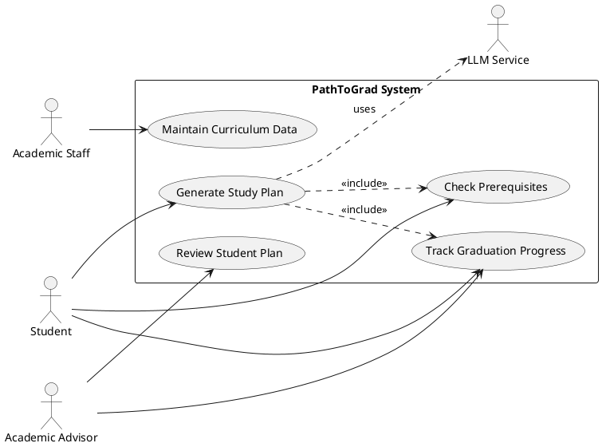

# Use Case Diagram

## Overview

This use case diagram describes the main functions of the PathToGrad system. The system helps students generate a study plan, check course prerequisites, and track graduation progress. Academic advisors can review student plans, while academic staff maintain curriculum data.

## Actors

| Actor            | Description                                                   |
| ---------------- | ------------------------------------------------------------- |
| Student          | Uses the system to create and manage a study plan.            |
| Academic Advisor | Reviews student plans and checks graduation progress.         |
| Academic Staff   | Maintains course and curriculum information.                  |
| LLM Service      | Supports the system in generating study plan recommendations. |

## PlantUML Diagram

## Explanation

The **Student** is the main user of the system. The student can generate a study plan, check prerequisites, and track graduation progress.

The **Academic Advisor** can review the student's study plan and check the student's graduation progress before giving academic guidance.

The **Academic Staff** maintains the curriculum data, including courses, prerequisite rules, and graduation requirements.

The **LLM Service** supports the study plan generation process. However, prerequisite checking and graduation progress tracking are still validated by system rules and curriculum data.
