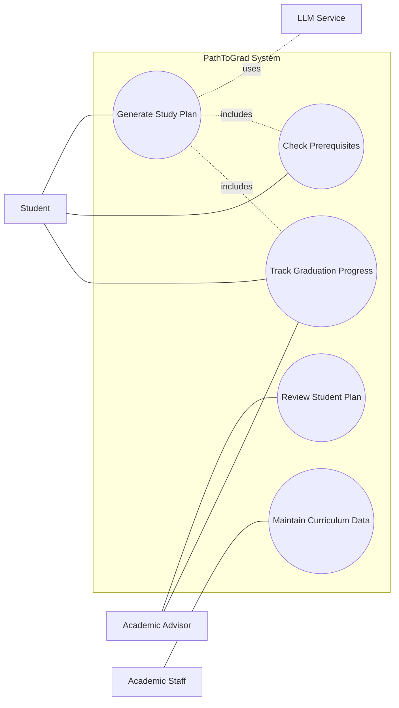

# Use Case Diagram

## Overview

The use case diagram shows the main functions of the PathToGrad system. The system supports students in planning their study path, checking prerequisites, and tracking graduation progress. Academic advisors can review student plans, while academic staff maintain curriculum data.

## Actors

| Actor            | Description                                                   |
| ---------------- | ------------------------------------------------------------- |
| Student          | Uses the system to generate and manage a study plan.          |
| Academic Advisor | Reviews student plans and provides academic guidance.         |
| Academic Staff   | Updates and maintains curriculum and prerequisite data.       |
| LLM Service      | Supports the system in generating study plan recommendations. |

## Use Case Diagram

## Explanation

* The **Student** is the main actor of the system.
* The student can generate a study plan, check prerequisites, and track graduation progress.
* The **Academic Advisor** can review the student's study plan and check graduation progress.
* The **Academic Staff** maintains curriculum data, including courses and prerequisite rules.
* The **LLM Service** is used only to support study plan generation.
* Prerequisite checking and graduation progress tracking are still validated by system rules and curriculum data.
